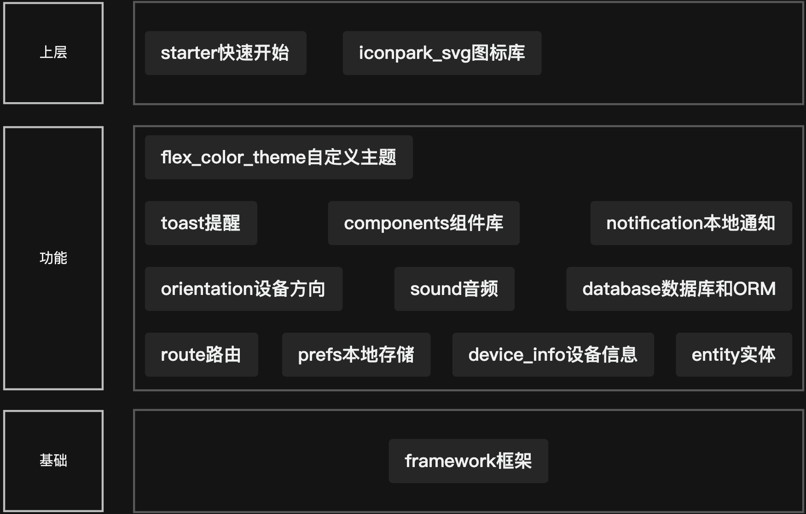

自己开发的一些Flutter相关的包。
License如果不特别标注，都是MIT。


结构图。

添加依赖
```yaml
# 框架
hgs_framework:
  git:
    url: https://github.com/humanghosts/flutter_packages.git
    path: framework
# 设备信息
hgs_device_info:
  git:
    url: https://github.com/humanghosts/flutter_packages.git
    path: device_info
# shared_preferences助手
hgs_prefs:
  git:
    url: https://github.com/humanghosts/flutter_packages.git
    path: prefs
# 提示、应用内通知和上下文菜单
hgs_toast:
  git:
    url: https://github.com/humanghosts/flutter_packages.git
    path: toast
# 本地通知
hgs_notification:
  git:
    url: https://github.com/humanghosts/flutter_packages.git
    path: notification
# 组件
hgs_components:
  git:
    url: https://github.com/humanghosts/flutter_packages.git
    path: components
# 实体
hgs_entity:
  git:
    url: https://github.com/humanghosts/flutter_packages.git
    path: entity
# 任务处理
hgs_work:
  git:
    url: https://github.com/humanghosts/flutter_packages.git
    path: work
# 音频
hgs_sound:
  git:
    url: https://github.com/humanghosts/flutter_packages.git
    path: sound
# 设备方向
hgs_orientation:
  git:
    url: https://github.com/humanghosts/flutter_packages.git
    path: orientation
# 数据库和orm
hgs_database_api:
  git:
    url: https://github.com/humanghosts/flutter_packages.git
    path: database/database_api
hgs_database_sembast:
  git:
    url: https://github.com/humanghosts/flutter_packages.git
    path: database/database_sembast
# 自定义主题
hgs_flex_color_theme:
  git:
    url: https://github.com/humanghosts/flutter_packages.git
    path: theme/flex_color_theme
# iconpark图标库
hgs_iconpark_svg:
  git:
    url: https://github.com/humanghosts/flutter_packages.git
    path: icon/iconpark_svg

```